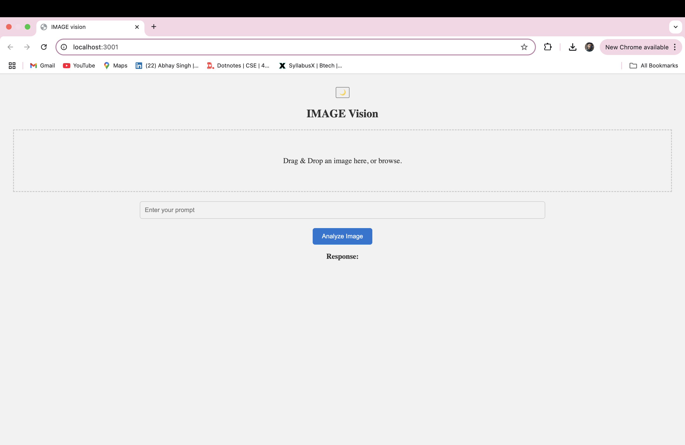
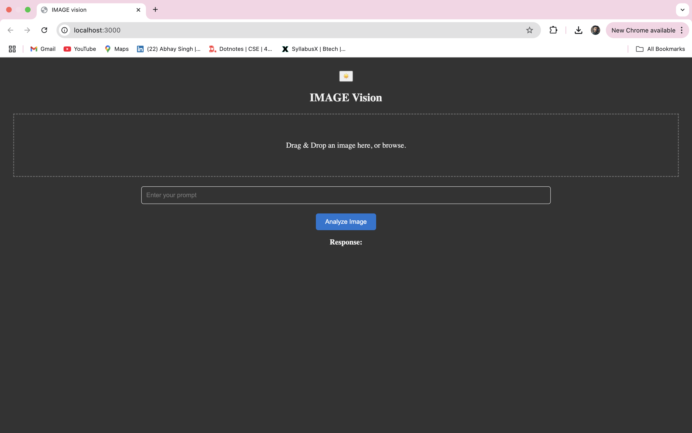
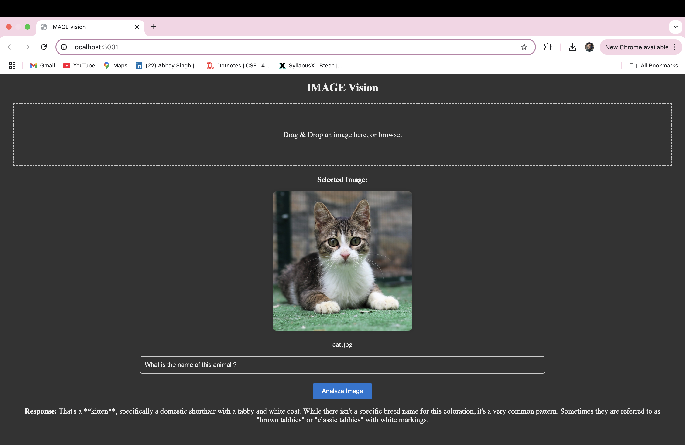

# VISION Image

**VISION Image** is a React-based web application that leverages Gemini AI for analyzing images. The app allows users to upload images, input custom prompts, and get detailed analysis of the image content using AI. It also features a custom **light/dark theme toggle** for enhanced user experience.

## Features

- 🌙 **Light/Dark Theme Toggle**: Easily switch between light and dark modes with a custom toggle button.
- 🖼️ **Image Upload**: Upload images using drag-and-drop or file selection.
- 💬 **AI Image Analysis**: Use Gemini to analyze and describe image content based on user prompts.
- 🚀 **Responsive Design**: Optimized UI for both desktop and mobile users.

## Tech Stack

- **Frontend**: React
- **Backend**: Gemini AI API for image analysis
- **Styling**: Custom CSS with responsive design
- **Features**: Theme Toggle, Image Upload, Gemini AI Integration

## Screenshots

### Light Mode

### Dark Mode

### Analysis 

## License
This project is licensed under the MIT License.
